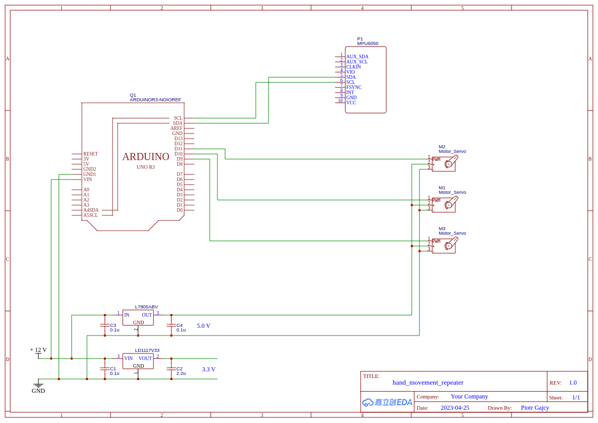
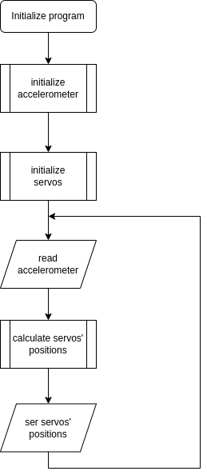

# hand-movement-repeater

## Hardware

### Components

* [Accelerometer MPU-6050](https://abc-rc.pl/product-pol-6572-Akcelerometr-3-osiowy-MPU-6050-GY-521-zyroskop-na-I2C.html) 
* [Arduino UNO Rev3] (https://botland.com.pl/arduino-seria-podstawowa-oryginalne-plytki/1060-arduino-uno-rev3-a000066-7630049200050.html)
* Breadboard

### Schematics

## Software

### Libraries

[MPU6050_light](./documentation/library_MPU6050_light.pdf)

### Flowchart 

